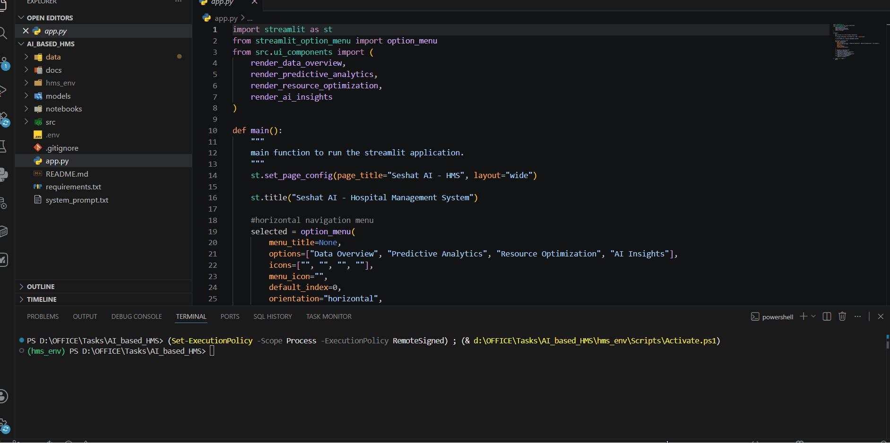
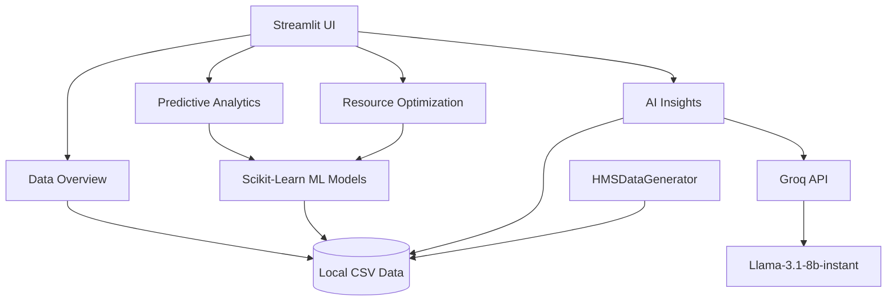

# Seshat AI - Hospital Management System (HMS)

Seshat AI is an enterprise-grade, AI-powered analytics and resource optimization platform for hospital management. This system provides a dynamic, comprehensive dashboard to visualize hospital data, predict patient no-shows with deep feature analysis, optimize bed occupancy against real-time capacity, and generate actionable insights using advanced machine learning models and large language models (LLMs).

## Live Demo


## Features

- **Enterprise Data Generation**: Generates highly complex, synthetic datasets linking patient demographics, chronic conditions, and wait times to appointments and admissions.
- **Dynamic Predictive Analytics**: Utilizes Scikit-Learn Random Forest Classifier to predict appointment no-shows by analyzing multi-dimensional patient features (age, distance, condition, historical adherence).
- **Resource Optimization & Tracking**: Forecasts length of stay using a Random Forest Regressor and tracks active ward utilization dynamically against total hospital capacity.
- **AI Insights Engine**: Integrates with the Groq API (llama-3.1-8b-instant) to generate context-aware, data-driven administrative recommendations.
- **Model Development Notebook**: Includes a fully executed Jupyter notebook containing deep Exploratory Data Analysis, Feature Engineering, and Hyperparameter Tuning (`GridSearchCV`).

## Folder Structure

```
AI_based_HMS/
├── app.py                     # Main Streamlit application entry point
├── data/
│   └── raw/                   # Generated synthetic datasets (patients, appointments, etc.)
├── docs/                      # Comprehensive technical and analytical documentation
├── models/                    # Serialized machine learning models and label encoders (.pkl)
├── notebooks/                 # Executed Jupyter notebook for model development
├── src/                       
│   ├── data_generator.py      # Script to generate enterprise synthetic data
│   ├── llm_agent.py           # Logic for interacting with Groq LLM
│   ├── ml_models.py           # Real-time inference predictor module
│   ├── train_models.py        # Offline model training and serialization pipeline
│   └── ui_components.py       # Modular Streamlit UI rendering functions
├── .env                       # Environment variables (API keys)
├── .gitignore                 # Git ignore configurations
├── README.md                  # Project documentation
├── requirements.txt           # Python dependencies
└── system_prompt.txt          # LLM system prompt instructions
```

## Architectural Diagram



## Setup Instructions

1. **Create and activate the virtual environment**:
   ```bash
   python -m venv hms_env
   hms_env\Scripts\activate
   ```

2. **Install the dependencies**:
   ```bash
   pip install -r requirements.txt
   ```

3. **Configure the environment**:
   - Ensure the `.env` file is present in the root directory with your `GROQ_API_KEY`.

4. **Train Models**:
   ```bash
   python -m src.train_models
   ```

5. **Run the Application**:
   ```bash
   streamlit run app.py
   ```
