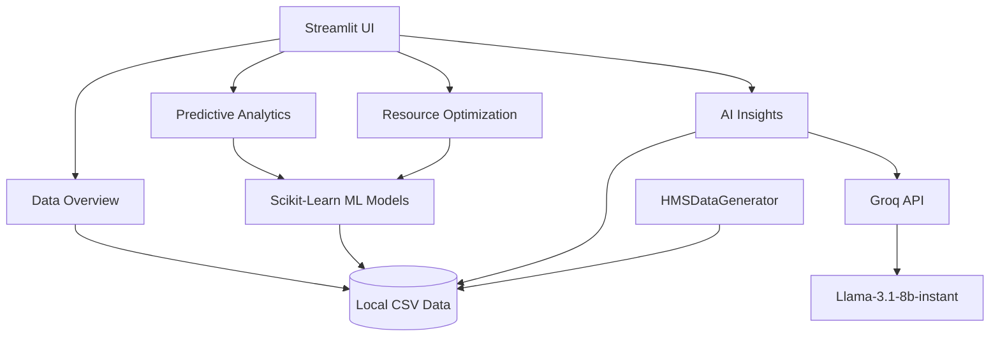

# Seshat AI - Hospital Management System (HMS)

Seshat AI is an AI-powered analytics and resource optimization platform for hospital management. This system provides a comprehensive dashboard to visualize hospital data, predict patient no-shows, optimize bed occupancy, and generate actionable insights using advanced machine learning models and large language models (LLMs).

## Features

- **Data Generation**: Generates highly realistic, synthetic datasets for patients, appointments, billing, doctor availability, and admissions.
- **Predictive Analytics**: Utilizes Random Forest models to predict appointment no-shows based on historical data.
- **Resource Optimization**: Estimates bed occupancy and lengths of stay to aid in optimal resource allocation.
- **AI Insights**: Integrates with the Groq API (llama-3.1-8b-instant) to generate data-driven recommendations and insights for hospital administration.

## Architectural Diagram



## Setup Instructions

1. **Create and activate the virtual environment**:
   ```bash
   python -m venv hms_env
   hms_env\Scripts\activate
   ```

2. **Install the dependencies**:
   ```bash
   pip install -r requirements.txt
   ```

3. **Configure the environment**:
   - Ensure the `.env` file is present in the root directory with your `GROQ_API_KEY`.

4. **Run the Application**:
   ```bash
   streamlit run app.py
   ```
